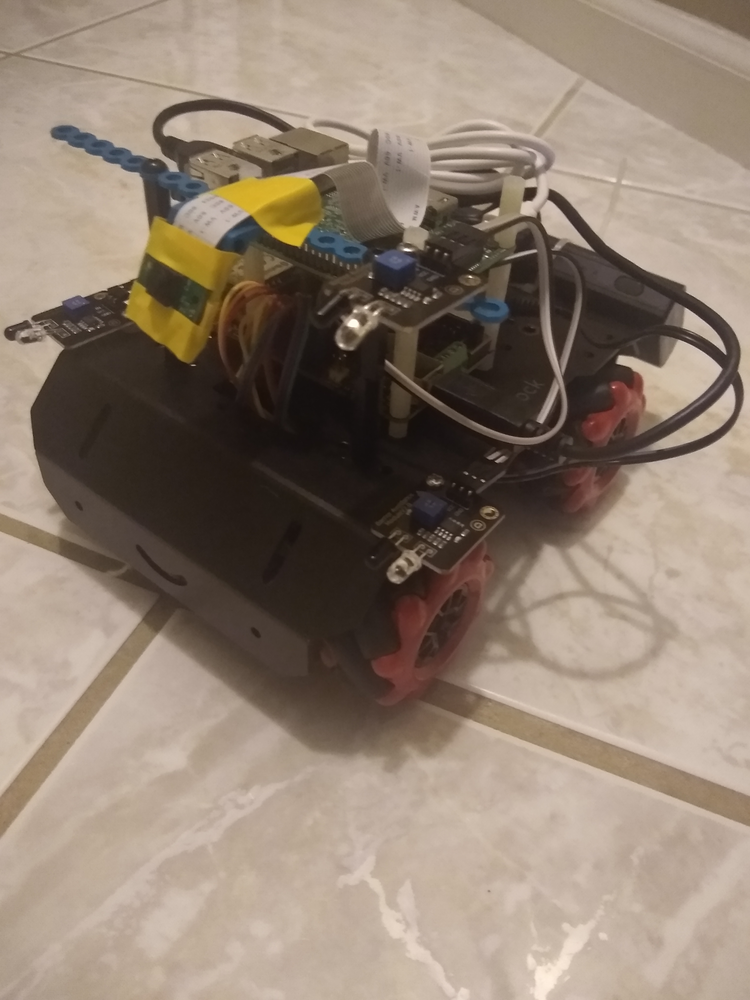

=======================
mbmega_face_expressions
=======================

This python package is a robot controller to entertain my kids

The robot performs a gesture with colors and motion when you show an expression on your face. 

* Free software: BSD license

Hardware
--------

- mBot Mega robot with MegaPi motion module
    https://www.makeblock.com/project/megapi

  * 4 mecanum wheels
  * RGB LED 2x4 
  * Line following sensor
  * IR detection
  * Collision contact switches
 
- Raspberry Pi  
    https://www.raspberrypi.org/

- Raspberry Pi Camera Module
    https://picamera.readthedocs.io/en/release-1.13/index.html

ToDo
--------

- The Raspberry Pi doesn't appear to support tensorflow: need a plan B.  (works in simulation)_

Credits
-------

This package was created with Cookiecutter_ and the `audreyr/cookiecutter-pypackage`_ project template.

.. _Cookiecutter: https://github.com/audreyr/cookiecutter
.. _`audreyr/cookiecutter-pypackage`: https://github.com/audreyr/cookiecutter-pypackage

Lots of amazing open source work.   

https://github.com/ageitgey/face_recognition

https://github.com/priya-dwivedi/face_and_emotion_detection

